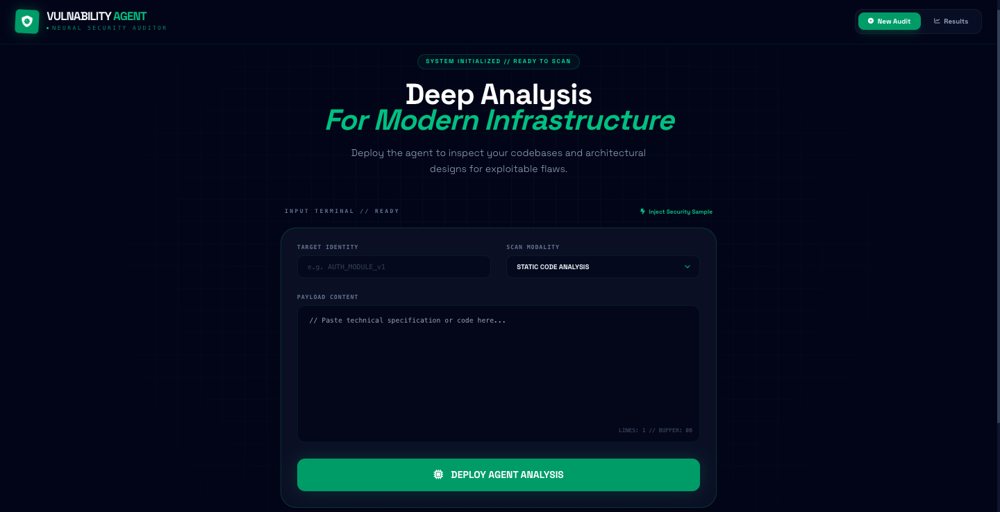
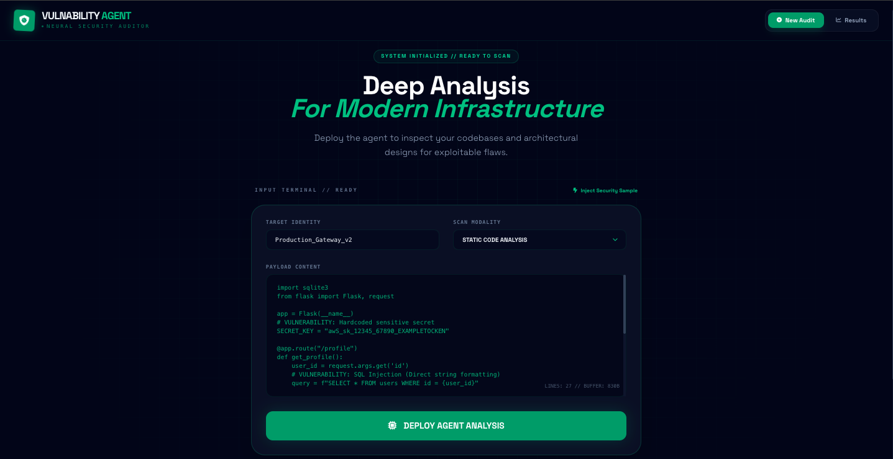
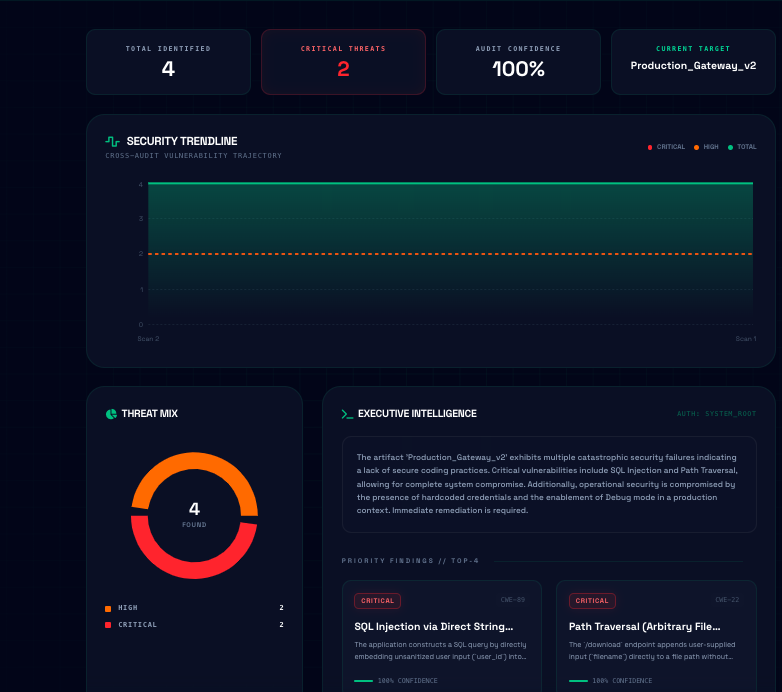
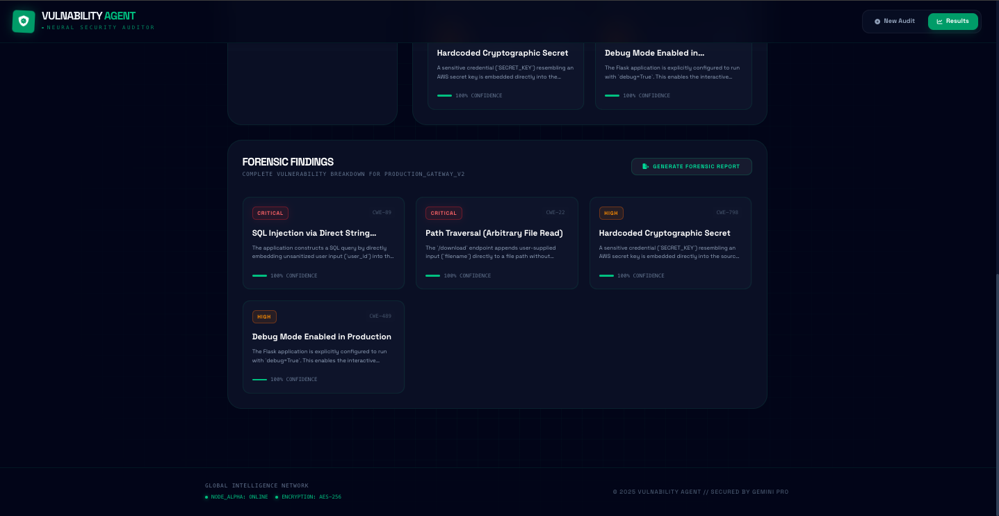

# 🛡️ Vulnerability Agent 
### *AI-Driven Virtual Penetration Tester*



[](https://deepmind.google/technologies/gemini/)
[](https://react.dev/)
[](https://tailwindcss.com/)

**Vulnerability Agent** is an AI-driven security researcher designed to act as a "virtual penetration tester." By leveraging the **Gemini 3 Pro** engine, it analyzes technical data to identify exploitable security flaws before they can be weaponized by malicious actors.

---

## 🚀 Overview

The app transforms raw text—whether it's Python code, a cloud architecture description, or API documentation—into a structured **Forensic Security Report**. It categorizes risks by severity (Critical to Low) and provides a confidence score for every finding.



---

## 🛠️ How It Works (The Pipeline)

1.  **Input Stage:** Feed the agent a target (e.g., "Auth Service") and its contents.
2.  **AI Logic:** The agent queries Gemini with specific "System Instructions" that force it to act like a clinical security auditor, cross-referencing against **OWASP Top 10** and **SANS Top 25**.
3.  **Structured Output:** The AI returns a JSON object containing technical descriptions, impact analysis, and a **Remediation Plan**.

---

## ✨ Key Features

### 📊 Security Dashboard
A high-tech UI that visualizes your "Threat Mix" using interactive pie charts and real-time security telemetry.


### 📈 Historical Trends & Forensics
* **Trend Tracking:** Monitor your security posture over time to see if "Critical" counts are trending down.
* **Deep-Dive Forensics:** Clicking any vulnerability opens a modal with a deep-dive analysis, including the specific **CWE ID** and a remediation patch.



---

## 💻 Technical Stack

* **Intelligence:** `@google/genai` (Gemini 3 Pro)
* **UI Framework:** React 19 with a "Cyber-Grid" aesthetic (Tailwind CSS)
* **Visualizations:** Recharts
* **Forensics:** Integrated CWE identification and automated impact scoring

---

## 🚦 Getting Started

### Prerequisites
* Node.js (v18+)
* Google Gemini API Key

### Installation

1. **Clone the repository:**
   ```bash
   git clone [https://github.com/DakshinaX/Vulnability-Agent.git](https://github.com/DakshinaX/Vulnability-Agent.git)
   cd Vulnability-Agent

```

2. **Install dependencies:**
```bash
npm install

```


3. **Set up environment variables:**
Create a `.env` file:
```env
VITE_GEMINI_API_KEY=your_api_key_here

```


4. **Run the development server:**
```bash
npm run dev

```


---

## 📄 License

Distributed under the MIT License.

**Disclaimer:** *This tool is for educational and authorized security testing purposes only. Always obtain permission before scanning production systems.*
